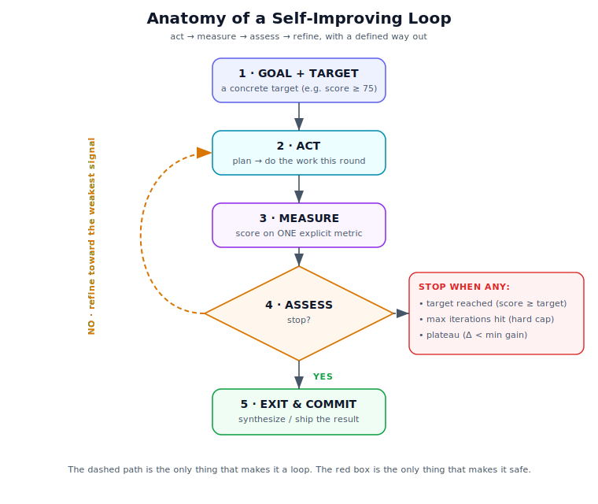
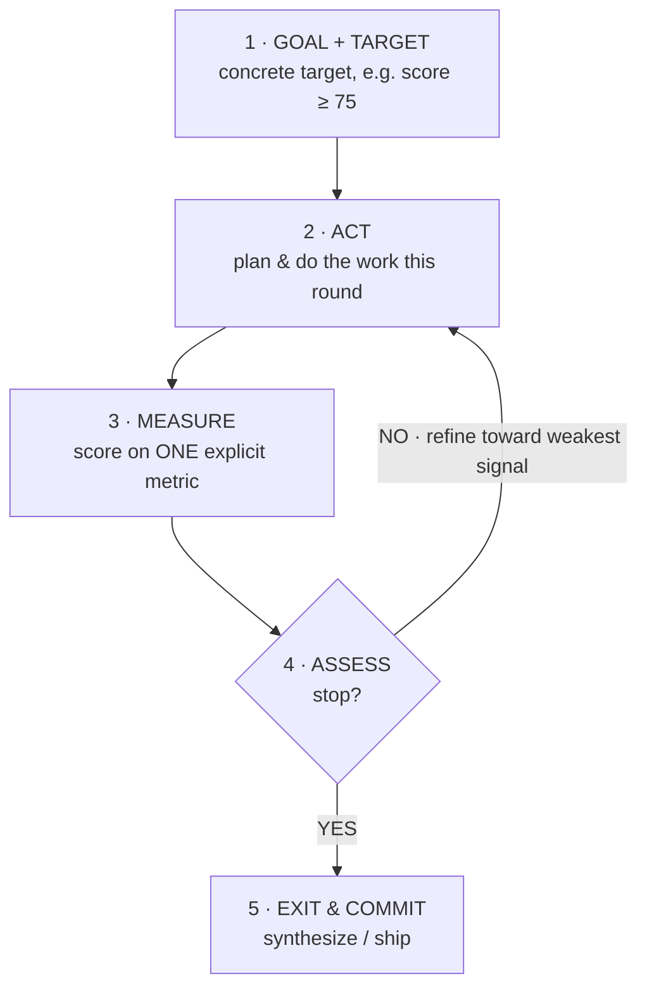

# What Makes a Good Agentic Loop?

*A field guide to self-improving loops — the difference between an agent that grinds
forever and one that knows when it's done.*

---

## The one-shot trap

Most "AI features" are a single call: prompt in, answer out. That's fine for a one-off
question. It falls apart the moment the task needs **judgment over multiple steps** —
research, debugging, writing, planning — because the model can't tell whether its first
attempt was actually good enough.

A **loop** fixes that. Instead of trusting one pass, the agent *acts, measures its own
output, decides whether that's good enough, and — if not — tries again, smarter.* That
feedback cycle is how an agent gets from "plausible" to "actually good."

But a loop is also where most agents go wrong. The naive version —

```
while (not satisfied) { try again }
```

— has no definition of "satisfied," so it either stops too early or runs forever (and
burns money). A good loop is a small piece of engineering, not a vibe.

---

## What a loop actually is



Strip it down and every good agentic loop has five parts and one escape hatch:



1. **Goal + target** — *what* you want, and a **concrete bar** that says you've reached it.
2. **Act** — do the work for this iteration.
3. **Measure** — turn the output into a **number** on an explicit metric.
4. **Assess** — compare the number to the target and decide: stop or go again.
5. **Exit & commit** — when you stop, produce the final artifact.

The **dashed feedback arrow** is the only thing that makes it a loop. The **stop
condition** is the only thing that makes it safe.

---

## Best practices

### 1. Define a concrete target, not a feeling
"Loop until it's good" is not a stop condition — it's a wish. Pick a number: a score
threshold, a test-pass rate, a coverage percentage. If you can't measure "good," you can't
loop toward it.

### 2. Measure progress with a single, explainable score
Collapse quality into **one number** the loop can compare round-over-round. It's fine for
that number to be a weighted blend of sub-signals — but the loop steers on the headline
score. If the score isn't explainable, you won't trust its decisions.

### 3. Always have *more than one* way to stop
A robust loop stops when **ANY** of these is true:
- **Target reached** — the score cleared the bar. (The happy path.)
- **Max iterations** — a hard cap. The backstop against runaway cost, regardless of score.
- **Plateau** — the round-over-round gain dropped below a minimum. *Diminishing returns
  are a reason to stop,* not to keep grinding.

Never ship a loop with only the happy-path exit. The other two are what save you at 3am.

### 4. Cap iterations — always
Even if your target logic is perfect, bugs and adversarial inputs happen. A hard iteration
cap is cheap insurance against an infinite, wallet-draining loop.

### 5. Refine toward the *weakest* signal, not randomly
When you decide to go again, don't just "try harder." Look at *which* sub-signal is
dragging the score down and aim the next iteration at it. Low source diversity? Search
different places. Low coverage? Chase the unanswered sub-questions. Targeted refinement
converges; random retrying thrashes.

### 6. Separate the "doer" from the "judge"
The thing that produces the work and the thing that scores it should be different
concerns. If the worker grades its own homework with the same loose prompt, it will
happily declare victory. Make the evaluator strict and independent.

### 7. Make every iteration inspectable
Log what each round did: the inputs it tried, what it found, what it rejected and *why*,
the score, and the decision. When a loop misbehaves, the log is the difference between a
five-minute fix and a mystery.

### 8. Cache and make runs replayable
Cache expensive side-effects (web fetches, tool calls) so a re-run is fast and
deterministic enough to debug. You will run the loop hundreds of times while tuning it.

### 9. Fail safe — degrade, don't crash
Any single step (a flaky API, a paywalled page) should fail to a fallback, not kill the
run. A loop that crashes on the first bad source never finishes.

### 10. Accumulate, don't thrash
Carry the best results forward across iterations instead of starting fresh each round.
The loop should *build on* prior work, not relitigate it.

---

## Anti-patterns to avoid

- **No exit condition** — the infinite loop. Always answer "what makes this stop?"
- **"Loop until it feels good"** — unmeasurable; it will stop arbitrarily.
- **Optimizing a proxy you don't believe** — if the metric is gameable, the loop *will*
  game it (Goodhart's Law). Pick a metric that actually correlates with quality.
- **Moving the goalposts mid-loop** — changing the target each round means you're not
  converging on anything.
- **Unbounded cost** — no iteration cap + a paid model = a surprise invoice.

---

## A worked example: PulseAI's research loop

This isn't theoretical — it's the loop powering [PulseAI](../README.md), a self-improving
research agent. Give it a topic; it loops:

> **plan** sub-queries → **search** (whole-web + communities) → **gate** out junk →
> **extract** full text → **score** the research → **assess** → refine or **synthesize**.

Its stop condition is exactly best-practice #3, encoded literally:

```
STOP when:  researchScore ≥ 75      (target reached)
         OR rounds ≥ 3              (hard cap)
         OR gain < 5 points         (plateau)
```

The score is a transparent blend (best-practice #2):

```
researchScore = 0.35·sourceQuality + 0.20·diversity + 0.35·coverage + 0.10·recency
```

### Watching the loop improve — for real

When PulseAI's search layer was starved (one search engine offline, another rate-limited),
a run on *"small language models"* looked like this:

| Round | Score | Coverage | Weakest signal | Decision |
|------:|:-----:|:--------:|:---------------|:---------|
| 1 | 48 | 15 | coverage | refine → search differently |
| 2 | 54 | 28 | coverage | refine again |
| 3 | 53 | 23 | coverage | **stop (max rounds)** — never cleared the bar |

The loop did its job — it *correctly diagnosed* that coverage was the problem (best-practice
#5) — but it was starved of good sources, so it topped out at **53** and stopped on the
iteration cap.

So we fixed the inputs the loop was begging for: restored whole-web search, and routed
short keyword queries to the community sources that were returning nothing. Same topic,
same loop:

| Round | Score | Coverage | Source quality | Weakest signal | Decision |
|------:|:-----:|:--------:|:--------------:|:---------------|:---------|
| 1 | **74** | 71 | 92 | diversity | 74 < 75 → refine toward diversity |
| 2 | 70 | 58 | 92 | diversity | **stop (plateau, Δ = −4)** |

**Coverage went 15 → 71. The headline score went 53 → 74** — one point under target, then
it correctly recognized the next round didn't help and **stopped on the plateau rule**
rather than burning a third round chasing a point.

That second table is the whole point of this article: a good loop is **legible**. You can
read exactly *why* it kept going, *why* it stopped, and *what* to fix to make it better. A
`while (not satisfied)` loop can't tell you any of that.

---

## A copy-paste checklist

Before you ship a loop, can you answer all of these?

- [ ] What is the **concrete target**? (a number, not a feeling)
- [ ] What **single score** does the loop steer on, and is it explainable?
- [ ] What are my **three** stop conditions (target / cap / plateau)?
- [ ] What's the **hard iteration cap**?
- [ ] On a "no", how do I **refine toward the weakest signal**?
- [ ] Is the evaluator **independent** of the doer?
- [ ] Can I **read the log** of every round's decisions?
- [ ] Does any single failure **degrade gracefully** instead of crashing?

---

## Further reading

- **ReAct: Synergizing Reasoning and Acting in Language Models** — Yao et al., 2022. The
  reason→act→observe loop that underpins most tool-using agents.
- **Reflexion: Language Agents with Verbal Reinforcement Learning** — Shinn et al., 2023.
  Loops that improve by reflecting on their own prior attempts.
- **The OODA loop** (Observe–Orient–Decide–Act) — John Boyd. The original "fast feedback
  beats raw power" idea, decades before LLMs.
- **Control theory / feedback control** — the engineering discipline of steering a system
  toward a setpoint using measured error. An agentic loop is a feedback controller whose
  "plant" is an LLM.

---

*Written while building PulseAI — a self-improving research agent whose entire Phase 1 is
the loop described above. The example numbers are from real runs.*
