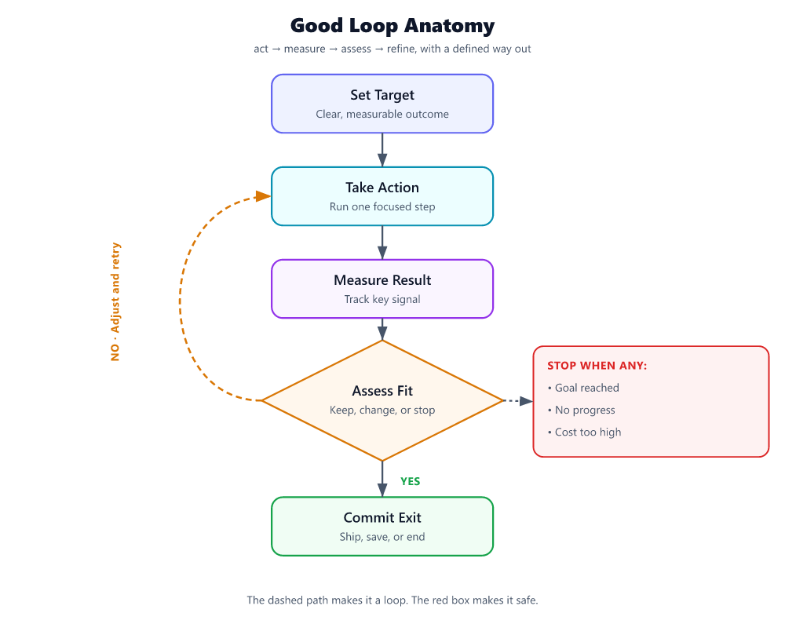

# What Is a Loop in AI Agents, How Do You Create a Good One, and What Are the Best Practices?

If an agent only generates once, it is not running a loop. It is taking a single shot.

A **loop** is the repeated control cycle that lets an agent **choose a step, take that step, inspect the result, and decide what to do next**. In agent workflows, that pattern is often expressed as **Thought → Action → Observation**, repeated until the task is complete or the system stops [S4]. That structure matters because many agent tasks depend on tool results, intermediate decisions, and changing state rather than on the initial prompt alone [S1][S2].

A good loop is not “more reasoning.” It is **bounded iteration with feedback**.

## What a loop is

At runtime, a loop usually does six things:

1. **Read the goal**
2. **Select the next action**
3. **Execute one bounded step**
4. **Observe the result**
5. **Update the working state**
6. **Stop or continue** [S4]

That is the difference between a responder and an agent. Agent systems are useful when they can combine planning, tool use, memory, and interaction across multiple steps instead of betting everything on the first output [S1][S2].

## Why one-shot breaks down

One-shot generation works for direct questions. It breaks on tasks where the answer depends on what happens during execution.

Typical cases:

- **The agent needs tool results before it can finish.** Search, retrieval, APIs, and code execution produce information that does not exist in the prompt at the start [S1].
- **The task has intermediate decisions.** Multi-step work requires choosing what to do after each result, not only producing a polished final answer [S1][S2].
- **The environment can change.** In interactive settings, the next step depends on the latest observation, not on a fixed plan made upfront [S2][S4].

A simple example:

- **One-shot:** “Book the cheapest flight.”
- **Loop:**  
  1. Ask for missing constraints  
  2. Search flights  
  3. Notice no acceptable option from the preferred airport  
  4. Expand to nearby airports  
  5. Re-rank results by total cost and timing  
  6. Return the best options

The point is not extra chatter. The point is **course correction**.

---

## How to create a good loop

A strong loop has four properties:

- a **clear target**
- a **small, explicit state**
- **decision-ready observations**
- **hard stop rules**

Everything else is secondary.

### 1) Define success before the first iteration

Do not start with “help me research” or “figure this out.”

Start with a completion rule.

Bad:
- “Help with research”

Good:
- “Return 3 vendors with pricing evidence, source links, and a recommendation”
- “Fix the failing test and show the diff”
- “Answer the policy question and cite the relevant section”

If “done” is vague, the loop wanders.

### 2) Keep loop state small and explicit

A loop should not drag an entire transcript around as its working memory. It should carry only what the next iteration needs.

Minimum state:

- **goal**
- **success criteria**
- **current subtask**
- **facts confirmed so far**
- **open questions / blockers**
- **constraints**
- **iteration count**
- **retry count**
- **budget left**
- **status**

Example:

```yaml
goal: "Find 3 payroll software options for a 200-person manufacturer"
success_criteria:
  - 3 relevant vendors
  - pricing evidence for each
  - recommendation with rationale
constraints:
  - max_iterations: 8
  - max_tool_calls: 12
  - ask_user_if_required_input_missing: true
current_subtask: "find candidate vendors"
facts: []
blockers: []
iteration: 1
retries_for_current_step: 0
status: "running"
```

### 3) Make each iteration do one bounded thing

The fastest way to ruin a loop is to let one step plan, search, compare, verify, and conclude all at once.

Each iteration should answer three questions:

1. **What do I know now?**
2. **What is the best next step?**
3. **What result would count as progress?**

Use a tight structure:

```text
THINK: choose the next subtask
ACT: take one bounded action
OBSERVE: summarize what changed
DECIDE: continue, re-plan, ask the user, or stop
```

That keeps the loop debuggable and aligned with the Thought → Action → Observation pattern [S4].

### 4) Turn raw results into usable observations

A loop improves only when its observations are usable for the next decision.

Bad observation:
- “Search returned results”

Good observation:
- “Search returned 7 results; 4 are irrelevant, 2 are vendor pricing pages, 1 is a comparison article. We have pricing evidence for Vendor A and Vendor B, but still need a third qualified option.”

That kind of observation is useful because it tells the loop what changed and what remains.

### 5) Re-plan instead of blindly retrying

A loop should not keep repeating the same failed action unless something material changes.

Good rule set:

- **Retry once** for a likely transient failure
- **Retry at most twice** if you can change parameters
- **Switch strategy after 2 failed attempts**
- **Ask the user** if the blocker is missing input, missing credentials, or a decision only the user can make
- **Stop** if the action cannot succeed within policy, budget, or available tools

That is a practical default, not a law. But it is a much better starting point than unlimited retries.

### 6) Add hard stop conditions up front

A loop without stop conditions is not sophisticated. It is expensive.

Use multiple stop rules, not just “task complete.”

#### Default stop conditions

- **Success reached**
- **Max iterations hit**  
  Default: **6–8 iterations** for a standard business task
- **Max retries for the same subtask hit**  
  Default: **2**
- **No progress for 2 consecutive iterations**
- **Required user input is missing**
- **Budget or latency cap reached**
- **Risk or confidence threshold says escalate**

#### What counts as “no progress”

Treat an iteration as **no progress** if none of these changed:

- no new fact was confirmed
- no blocker was removed
- no success criterion moved closer to completion
- no better next path was identified

If that happens twice in a row, the loop should **re-plan, ask the user, or stop**.

---

## A minimal loop you can actually build

Here is a simple loop skeleton with sensible defaults.

```python
state = {
    "goal": "...",
    "success_criteria": [...],
    "facts": [],
    "blockers": [],
    "current_subtask": "...",
    "iteration": 0,
    "max_iterations": 8,
    "same_step_retries": 0,
    "max_same_step_retries": 2,
    "no_progress_streak": 0,
    "max_no_progress_streak": 2,
    "status": "running"
}

while state["status"] == "running":
    state["iteration"] += 1

    if state["iteration"] > state["max_iterations"]:
        state["status"] = "stopped_max_iterations"
        break

    next_action = choose_next_action(state)
    result = execute(next_action)
    observation = summarize_result(result)

    progressed = evaluate_progress(observation, state["success_criteria"])

    if progressed:
        state["no_progress_streak"] = 0
        state["same_step_retries"] = 0
        update_state(state, observation)
    else:
        state["no_progress_streak"] += 1

        if observation["needs_user_input"]:
            state["status"] = "awaiting_user"
            break

        if observation["retryable"] and state["same_step_retries"] < state["max_same_step_retries"]:
            state["same_step_retries"] += 1
            adjust_parameters(state, observation)
            continue

        replan(state, observation)

    if success_reached(state):
        state["status"] = "completed"
        break

    if state["no_progress_streak"] >= state["max_no_progress_streak"]:
        state["status"] = "stopped_no_progress"
        break
```

That is enough for many useful agent workflows. Start there before adding hierarchy, critics, or multi-agent orchestration.

---

## Bad loop vs. good loop

The easiest way to understand loop quality is to compare failure and control.

### Bad loop

Task: **“Find three payroll software options with pricing evidence.”**

**Iteration 1**
- Search for payroll software  
- Result: generic list article

**Iteration 2**
- Search for payroll software again  
- Result: another generic list article

**Iteration 3**
- Search for best payroll software pricing  
- Result: mixed blog posts

**Iteration 4**
- Guess three vendors and write a recommendation

Why this is bad:

- no explicit success criteria
- no definition of acceptable evidence
- repeated low-value search behavior
- no rule for replacing weak sources
- stops on a plausible answer, not a verified one

### Good loop

Task: **“Find three payroll software options for a 200-person manufacturer, include pricing evidence, and recommend one.”**

**Iteration 1**
- **Subtask:** find qualified candidates
- **Action:** search for vendors relevant to mid-sized businesses and manufacturing needs
- **Observation:** 5 potential vendors; 3 look relevant enough to verify
- **Decision:** verify pricing evidence for those 3

**Iteration 2**
- **Subtask:** collect pricing evidence
- **Action:** visit official pricing pages or equivalent primary sources
- **Observation:** Vendor A has public pricing, Vendor B is quote-only, Vendor C has no pricing page
- **Decision:** keep A and B, replace C unless stronger evidence appears

**Iteration 3**
- **Subtask:** replace weak candidate
- **Action:** search for another relevant vendor with accessible pricing evidence
- **Observation:** Vendor D qualifies and has published pricing
- **Decision:** compare A, B, and D

**Iteration 4**
- **Subtask:** recommend
- **Action:** score against user criteria
- **Observation:** D fits best, A is cheaper, B lacks pricing transparency
- **Decision:** recommend D, note caveats, stop

Why this is good:

- success criteria were defined in advance
- every iteration had one purpose
- observations changed the next action
- weak evidence triggered replacement, not wishful thinking
- the loop stopped when the task was actually complete

---

## Best practices for loop creation

### Keep the control policy simple

Start with:

**plan → act → observe → decide**

Do not begin with a sprawling architecture. Agent systems vary in complexity, but complexity is a choice, not a requirement [S2]. A clean single loop beats a clever tangled one.

### Use concrete actions

A loop should produce inspectable steps:

- one search query
- one API call
- one retrieval step
- one code patch
- one clarification question
- one scoring pass

Concrete actions are easier to verify, log, and debug.

### Define acceptable evidence

Many loops fail because they never define what counts as a valid result.

Examples:

- for research: official docs, vendor pricing pages, named primary sources
- for coding: passing tests, changed files, expected output
- for support: cited policy section, account status, approved action

If evidence quality matters, encode it in the loop state.

### Prefer structured observations over free-form summaries

Use fields like:

```json
{
  "action": "verify_pricing",
  "result": "partial_success",
  "facts_learned": [
    "Vendor A has public pricing",
    "Vendor B requires quote"
  ],
  "blockers": [
    "Vendor C has no accessible pricing page"
  ],
  "progress_made": true,
  "needs_user_input": false,
  "retryable": false,
  "recommended_next_action": "replace_vendor_c"
}
```

Structured handoffs reduce ambiguity and make the next decision easier.

### Separate doing from judging

Do not let the same step both perform work and declare victory without a check.

Use this pattern:

1. execute
2. observe
3. evaluate against success criteria
4. accept, repair, or re-plan

That discipline matters more than long reasoning.

### Compress context aggressively

Keep:

- confirmed facts
- decisions made
- unresolved blockers
- artifacts that matter

Drop:

- repeated internal deliberation
- stale branches
- old raw outputs once summarized

Long transcripts are not a sign of quality. They are often a sign that the loop is losing control.

### Ask the user at the right time

Do not ask the user too early. Do not wait too long either.

Ask when:

- a required input is missing
- multiple valid paths depend on user preference
- credentials or permissions are required
- the loop hits a policy or risk boundary
- evidence is conflicting and the choice is consequential

Default rule: **if the blocker cannot be resolved with one more bounded action, ask the user instead of guessing**.

### Log every iteration

At minimum, log:

- iteration number
- current subtask
- action taken
- result status: success / partial / fail
- facts gained
- blockers found
- retry count
- no-progress streak
- latency / tool cost
- stop reason

If you cannot explain why the loop stopped, you do not control the loop.

---

## A practical stop-condition checklist

Use this checklist before shipping any agent loop.

### The loop should stop when:

- [ ] every success criterion is met
- [ ] the answer includes the required evidence
- [ ] max iterations is reached
- [ ] max retries for the same step is reached
- [ ] two consecutive iterations make no progress
- [ ] required user input is missing
- [ ] cost or latency cap is exceeded
- [ ] the task crosses a risk or approval boundary

### Recommended defaults

- **Max iterations:** 6–8
- **Max retries for the same step:** 2
- **No-progress threshold:** 2 consecutive iterations
- **Ask-the-user threshold:** after one failed attempt if the blocker is missing input or authorization
- **Verification requirement:** mandatory before final output for high-impact tasks

These defaults are conservative on purpose. You can always loosen them after you see real traces.

---

## Common loop mistakes

### 1) Infinite retries

If the same step keeps failing, the loop should change something meaningful or stop.

### 2) Giant planning before any observation

If the task depends on tools, get evidence early. Thought → Action → Observation works because it interleaves reasoning with real feedback [S4].

### 3) No success criteria

Without a definition of done, the loop either stops too soon or never stops cleanly.

### 4) Treating activity as progress

More steps do not mean a better loop. A good loop reduces uncertainty or moves the task closer to done.

### 5) Carrying the whole transcript forever

That is not memory. That is context bloat.

### 6) Ending on an unverified claim

Do not stop on “this should work” when you can check.

---

## The build recipe

If you need a practical recipe, use this one:

1. **Write the goal in one sentence**
2. **List 2–4 concrete success criteria**
3. **Define what counts as acceptable evidence**
4. **Create a small state object**
5. **Limit each iteration to one bounded action**
6. **Summarize results into structured observations**
7. **Retry once, retry twice only with changed parameters**
8. **Re-plan after repeated failure**
9. **Ask the user when the blocker is missing input or authority**
10. **Stop on success, no progress, or budget**

That is how you create a loop that is useful in practice, not just elegant on a whiteboard.

## The takeaway

A loop in an AI agent is the repeated cycle that lets the system **act, inspect, and adjust** rather than answer once and hope for the best. The standard pattern is **Thought → Action → Observation**, repeated until a clear stop condition is met [S4]. That structure is what makes agents effective on tasks that require tools, intermediate decisions, and interaction with changing state [S1][S2].

The best loops are not elaborate. They are disciplined.

They have:

- a sharp goal
- explicit success criteria
- small state
- one bounded action per iteration
- decision-ready observations
- hard stop rules

If you remember one rule, make it this:

**A good loop does not keep going because it can. It keeps going only while each step earns the next one.**

---

## Sources
- [S1] [AI Agent Systems: Architectures, Applications, and Evaluation - arXiv](https://arxiv.org/html/2601.01743v1)
- [S2] [Agentic Artificial Intelligence (AI): Architectures, Taxonomies, and Evaluation of Large Language Model Agents](https://arxiv.org/html/2601.12560v1)
- [S3] [Show HN: Orcbot – an open-source autonomous agent framework](https://github.com/fredabila/orcbot)
- [S4] [Understanding AI Agents through the Thought-Action-Observation Cycle](https://huggingface.co/learn/agents-course/en/unit1/agent-steps-and-structure)
- [S5] [A Survey of Self-Evolving Agents What, When, How, and Where to ...](https://arxiv.org/html/2507.21046v4)
- [S6] [GitHub - VoltAgent/awesome-ai-agent-papers: A curated collection of AI agent research papers released in 2026, covering agent engineering, memory, evaluation, workflows, and autonomous systems. · GitHub](https://github.com/VoltAgent/awesome-ai-agent-papers)
- [S7] [Auditing Trajectory-Level Hallucinations in Multi-Agent Industrial ...](https://arxiv.org/html/2605.24219v2)
- [S8] [What Breaks When LLMs Code? Characterizing Operational Safety Failures of Agentic Code Assistants](https://arxiv.org/html/2605.30777v1)
- [S9] [Beyond Accuracy: A Multi-Dimensional Framework for Evaluating Enterprise Agentic AI Systems](https://arxiv.org/html/2511.14136v1)
- [S10] [A Comprehensive Review of AI Agents: Transforming Possibilities in Technology and Beyond](https://arxiv.org/html/2508.11957v1)
- [S11] [luo-junyu/Awesome-Agent-Papers - GitHub](https://github.com/luo-junyu/awesome-agent-papers)
- [S12] [Diffusion LLM may make most of the AI engineering stack obsolete](https://news.ycombinator.com/item?id=47336498)

---

*Generated by PulseAI — content self-refined over 2 round(s) to 88/100 (onTopic 93, grounding 74). Flowchart: model-authored labels + deterministic SVG layout. Source research scored 78.*
