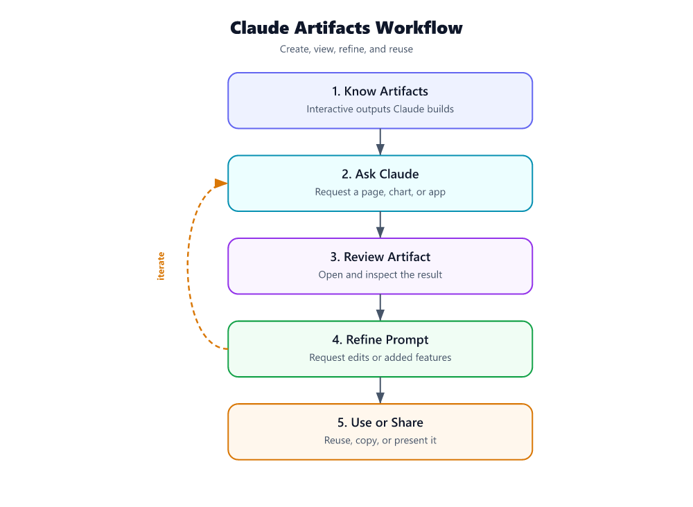

# What is a Claude artifact? How to create one and actually use it

If you searched for **Claude artifacts**, you do not need a lecture on agent orchestration. You need a clear answer to three questions:

1. **What is an artifact?**  
2. **How do you get Claude to create one?**  
3. **How do you refine and use it afterward?**

Here’s the practical version.

## What a Claude artifact is

A **Claude artifact** is the **concrete output Claude generates for you to keep working on**: a draft, a plan, a structured deliverable, or another piece of content you want to inspect, revise, and reuse.

The key distinction is simple:

- a **chat reply** answers a question
- an **artifact** gives you something you can **work on as an output**

In other words, the artifact is not the loop, the harness, or the orchestration layer. It is the **deliverable**.

That distinction matters because Claude-style systems are often described in terms of an iterative model-tool cycle — “a simple while-loop that calls the model, runs tools, and repeats” [S5]. But that loop is just the mechanism. The artifact is the thing the reader actually cares about: the output produced by that process.

## When artifacts appear

Artifacts are most useful when your prompt asks Claude to create something that stands on its own.

Typical examples include:

- a **step-by-step plan**
- a **polished draft**
- a **generated deliverable**
- a **reviewable output you want to iterate on**

That fits the draft’s strongest underlying idea: Claude is most useful when it produces something you can refine over multiple steps, not just a one-off answer.

Artifacts become especially valuable when the task is:

- **multi-step**
- dependent on prior context
- worth reviewing before you accept it
- likely to need revision

That matches the source material on plan-first workflows and dependency-heavy tasks. Orrery, for example, is positioned for **multi-step features requiring coordinated changes across many files** and tasks with **clear dependencies between implementation steps** [S2]. Even if your use case is not code, the same rule applies: when the output needs iteration, treat it like an artifact, not a disposable response.

## Where artifacts fit in Claude

The provided sources support Claude as a system that works through **planning, tools, context, and iteration** — not as a one-shot answer engine [S1][S4][S5]. So the practical way to think about artifacts in Claude is this:

- **Claude generates the artifact**
- **you review it**
- **you ask Claude to revise or extend it**
- **the artifact improves through iteration**

The sources do **not** clearly document a canonical, artifact-specific UI behavior, so it is better not to overclaim exact interface details. What the sources do support is the workflow around artifact creation: Claude can work from project context, produce plans and outputs in stages, and revise based on feedback [S1][S2][S4][S5].

## How to create an artifact

If you want Claude to produce an artifact instead of a generic reply, your prompt should ask for a **specific deliverable**.

### The basic formula

Use this structure:

> Create a **[deliverable type]** for **[goal]**.  
> Use **[context]**.  
> Format it as **[structure]**.  
> Optimize for **[audience or use case]**.  
> If assumptions are required, list them separately.

That prompt shape works because it forces Claude to produce something concrete rather than talk around the task.

### Example prompts

#### 1) Create a plan artifact
> Create a step-by-step implementation plan for adding user login to an existing app.  
> Include dependencies, unknowns, approval points, and a final checklist.  
> Keep it concise and structured for engineering review.

This aligns with the source-backed emphasis on **plan-first workflows** and explicit dependency handling [S1][S2].

#### 2) Create a writing artifact
> Create a 700-word customer-facing blog draft explaining our new feature.  
> Use a confident, technical tone.  
> Include a short intro, three core sections, and a closing takeaway.  
> Separate assumptions at the end.

#### 3) Create a reusable working draft
> Create a first-draft policy document for onboarding new vendors.  
> Organize it into purpose, scope, required documents, review steps, approval rules, and escalation paths.  
> Write it so I can revise each section independently.

### Add project context before you ask

If the artifact depends on your files, docs, rules, or past decisions, load that context first. Anthropic’s Projects feature is explicitly meant to bundle **relevant documents, chat history, and custom instructions** so Claude works from curated context instead of starting cold [S4].

That means artifact quality improves when you provide:

- source documents
- style rules
- prior decisions
- constraints
- success criteria

If you skip that, Claude may still produce an artifact — just a weaker one.

## Step-by-step workflow: create and use an artifact

Here is the simplest artifact workflow that stays on-topic and actually works.

### 1) Ask for one clear deliverable

Do not say:

- “Help me think about this”
- “What should I do?”
- “Make it better”

Say:

- “Create a rollout plan”
- “Draft the memo”
- “Produce a requirements outline”
- “Write the first version of the checklist”

The more concrete the deliverable, the more likely Claude will produce an artifact you can use.

### 2) Specify the format

Tell Claude what shape the artifact should take:

- bullets
- numbered plan
- table
- memo
- draft document
- checklist
- outline

This reduces cleanup and makes revision easier.

### 3) Give constraints up front

Add the rules that matter:

- audience
- tone
- length
- must-include sections
- exclusions
- approval criteria

This is especially important because Claude-style workflows perform better when grounded in explicit context and instructions [S1][S4].

### 4) Review the first version like an editor

Once Claude produces the artifact, do **not** throw away the momentum by starting over. Iterate on the same output.

Good follow-up prompts:

- “Tighten section 2 and remove repetition.”
- “Turn this into an executive summary.”
- “Add risks and mitigation steps.”
- “Rewrite this for non-technical readers.”
- “Keep the structure, but make the recommendations more specific.”

This is where artifacts become more useful than ordinary chat replies: you are no longer asking for fresh answers; you are improving a working deliverable.

### 5) Split revision into passes

The best refinement flow is usually:

1. **structure**
2. **content accuracy**
3. **tone**
4. **polish**

That mirrors the broader source pattern of separating planning from execution instead of doing everything at once [S1][S2].

### 6) Pause for approval when the artifact drives action

If the artifact will trigger implementation, a workflow change, or any higher-risk action, add a review gate. Orrery explicitly emphasizes reviewing a plan before autonomous execution [S2]. The same principle applies here: approve the artifact before using it downstream.

### 7) Reuse the artifact as working state

A good artifact is not just a final output. It can become the input to the next step.

Examples:

- a plan artifact becomes the basis for implementation
- a draft artifact becomes the basis for publication
- a checklist artifact becomes the basis for operations
- a structured summary becomes the basis for stakeholder review

That is the practical payoff.

## How to improve an artifact once Claude creates it

Most readers do not just want Claude to create an artifact once. They want to know how to make it better.

Use these refinement moves.

### Ask for expansion
> Expand section 3 with concrete examples and edge cases.

### Ask for compression
> Cut this by 40% without losing the main recommendations.

### Ask for restructuring
> Reorganize this into problem, options, recommendation, and next steps.

### Ask for audience adaptation
> Rewrite this for a VP audience with less jargon and clearer business impact.

### Ask for actionability
> Convert this draft into a checklist with owners, dependencies, and approval points.

### Ask for validation
> Identify assumptions, ambiguities, and places where this artifact still needs human review.

That last move matters. The sources repeatedly support **human review gates** in workflows that matter [S2][S3].

## Common artifact types that are actually useful

If you are not sure what to ask Claude to create, start with one of these.

### 1) Planning artifacts
Best for:
- implementation work
- projects with dependencies
- approval-heavy tasks

Supported by the source set’s emphasis on explicit planning and reviewable execution [S1][S2].

### 2) Drafting artifacts
Best for:
- blog posts
- memos
- policy drafts
- announcements
- documentation

### 3) Structured decision artifacts
Best for:
- options analysis
- tradeoff summaries
- recommendation memos
- risk registers

### 4) Operational artifacts
Best for:
- checklists
- runbooks
- SOPs
- escalation paths

### 5) Reusable instruction artifacts
Best for:
- recurring workflows
- repeated formatting needs
- standard operating guidance

This lines up with the source material on **reusable instruction packages and skills** [S7].

## Mistakes to avoid

### 1) Asking for “help” instead of asking for an artifact

If your prompt is vague, Claude will often give you a discussion instead of a usable output.

Bad:
> Help me think through onboarding.

Better:
> Create a vendor onboarding checklist with required documents, review steps, and approval gates.

### 2) Confusing the process with the deliverable

The loop is not the artifact. The planning system is not the artifact. The orchestration layer is not the artifact.

The artifact is the **thing produced**.

That matters because the underlying Claude workflow may involve iteration and tools [S5], but the user’s value comes from the output they can inspect and refine.

### 3) Skipping context

Claude works better when relevant project material, chat history, and instructions are available through Projects [S4]. If the artifact depends on your environment, give Claude that environment.

### 4) Trying to perfect everything in one prompt

A strong artifact usually comes from a few focused passes:

- create
- review
- revise
- finalize

That is more reliable than demanding perfection in one shot.

### 5) Using a heavyweight artifact workflow for trivial tasks

Not every task needs a full plan or formal deliverable. The source set is clear that direct agent use is better for **quick fixes** and exploratory work [S2]. If you just need a fast answer, ask for a fast answer. If you need something you can keep working on, ask for an artifact.

### 6) Letting Claude act on an unreviewed artifact

If the artifact becomes the basis for automated or higher-risk execution, insert a human checkpoint. That principle is directly supported in plan-review and headless-execution discussions [S2][S3].

## A practical example

Say your goal is to launch a new internal process.

Do this:

### Prompt 1: Create the artifact
> Create a first-draft rollout plan for a new vendor onboarding process.  
> Include phases, owners, dependencies, approval points, and risks.  
> Format it as a review-ready document.

### Prompt 2: Improve the artifact
> Tighten the plan into five phases.  
> Add a decision log and a final launch checklist.

### Prompt 3: Adapt it for use
> Convert this plan into a one-page executive summary for leadership review.

Same underlying work. Three useful artifacts.

That is the right mental model: **Claude creates outputs you can keep shaping into the exact form you need.**

## Quick takeaway

A Claude artifact is the **usable output**, not the machinery behind it.

If you want one:

1. ask for a **specific deliverable**
2. give Claude the **right context**
3. specify the **format**
4. revise the output in focused passes
5. add **human review** before using it for consequential work [S2][S3]

The shortest accurate summary is this:

> **An artifact is the thing Claude makes for you to keep working on.**  
> To create one, ask for a concrete deliverable.  
> To use one well, iterate on it instead of restarting from scratch.

---

## Sources
- [S1] [Piebald-AI/claude-code-system-prompts - GitHub](https://github.com/Piebald-AI/claude-code-system-prompts)
- [S2] [Show HN: Orrery – Spec Decomposition, Plan Review, and Agent Orchestration](https://github.com/CaseyHaralson/orrery)
- [S3] [Show HN: I am running 3 coding agents non-stop over the last 3 days. Here is how](https://news.ycombinator.com/item?id=48520757)
- [S4] [Collaborate with Claude on Projects - Anthropic](https://www.anthropic.com/news/projects)
- [S5] [Dive into Claude Code: The Design Space of Today's and Future AI ...](https://arxiv.org/html/2604.14228v1)
- [S6] [Claude's Constitution - Anthropic](https://www.anthropic.com/constitution)
- [S7] [ComposioHQ/awesome-claude-skills - GitHub](https://github.com/ComposioHQ/awesome-claude-skills)
- [S8] [Powering Frontier Transformation with Copilot and agents - Microsoft](https://news.google.com/rss/articles/CBMiuwFBVV95cUxOdVl1ZUxvZ2VFMzA2NWZSRkh5enJBcGxETGhRTF9rNnFRa0Z5UlhGbThSY3BmVmROd19GQUR6ZlBYalUwQzk4bHJzSE1wUW5sSXRWNHplMU5QMDJMVFlKclFJMmN0djJabm9rc0RDUTh2V1ZmbFI1RmdWN01XSm1nNXgzZmpIZE5xOE1Nb2N5MDVwQ3JFS0ZuSmEzeWxWTXUwMTZTdDJZR3dSNHVyMEpROG5WRF9IQWFBZUhB?oc=5)
- [S9] [Harness design for long-running application development - Anthropic](https://news.google.com/rss/articles/CBMiekFVX3lxTE9qTVhZVkFSR3BSeURxci1ESVA3MzNFQzlNRDY1YTV1ZFh6ZElYWEtRcllsN0ZVZk9HOTNCQ2drdWFzWV9RTm9IZVNWajJmSmw1c0t1LXJTZGpWOEZBYkFQS3ctVFJfRnJrWlJHNTZyV2dvRk5Bblp3RjBR?oc=5)
- [S10] [Effective harnesses for long-running agents - Anthropic](https://news.google.com/rss/articles/CBMiiAFBVV95cUxQbDhIQzg0T0dXZmVTVlR1ZjF5U1JLSGtRN213VmFIMHlPUFlEWGN4QkhLSDR6OEY4dGhVSDk2bElFUGEtQXJUNXpIdzF0MkRBTlNicmN4LThWb2hYdk54VEpNZE9uM25FSGpweGs1V2FWb0V5eEtKc3FSQkgzSXA3TmlfSkpVQUoy?oc=5)
- [S11] [Google Antigravity is an ‘agent-first’ coding tool built for Gemini 3 - The Verge](https://news.google.com/rss/articles/CBMijgFBVV95cUxNRXljMkdBLUJaRE1ZNjhSV3g2ZjVnR1hXTnoyQUozWjVMZkNvWHZzZkNGNm9KM25CUEVqWjVHSlNHOENuUFNQR1A4ajRLZkU3NklFMGgya0RyQ1IwZ3h0SzZiWE9jVGpObl9jbXlyWVBfSnlSVHFna2laSHVuTVp3WHBlZ2swVS10TVVDWHBR?oc=5)
- [S12] [How AI Is Transforming Work at Anthropic - Anthropic](https://news.google.com/rss/articles/CBMigAFBVV95cUxQZFBSaEZtOG1ieHpOdldrNVJEeGRCMEtJVmpNU1hOMHVNV1NldWJ1T3RuQlhTZXpkckk2akpUWFhqbGtabXRURFJiNDR4aG9YUjhUSzFadkZaYUJPNElQcDR4SkU2bHIyQkg3VDdmMWZ0eFM5ak52MThpcklEdVNfVg?oc=5)

---

*Generated by PulseAI — content self-refined over 2 round(s) to 68/100 (onTopic 72, grounding 34). Flowchart: model-authored labels + deterministic SVG layout. Source research scored 57.*
