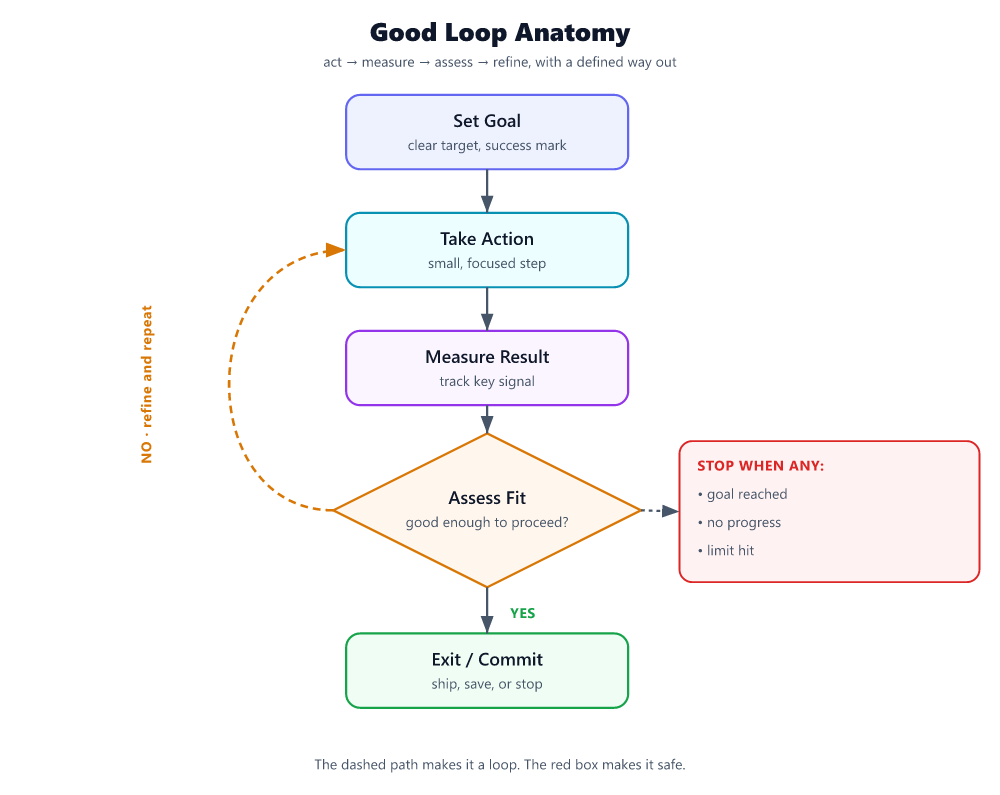

# What Is a Loop in AI Agent Systems? How to Build a Good One, and the Best Practices That Matter

If your agent only gets **one shot** to think, act, and return an answer, it will eventually fail in exactly the ways production systems always fail: bad tool arguments, timeouts, stale context, contradictory evidence, and convincing-but-wrong intermediate outputs [S1]. That’s why serious agent systems rely on a **loop**.

A loop is not “the agent rambling to itself.” In this context, a **loop is a bounded cycle of action → observation → validation → correction → next action**, repeated until the task succeeds, the system safely stops, or the budget runs out [S1][S3][S8].

That simple idea is the difference between a brittle one-shot workflow and a system that can recover when reality pushes back.

## What a loop is — and why one-shot isn’t enough

A **loop** is the runtime structure that lets an agent:

1. **Take a step** toward the goal  
2. **Inspect what happened**
3. **Judge whether that step worked**
4. **Adjust the next step accordingly**
5. **Repeat under explicit limits** [S1][S8]

In practice, that might mean:

- calling a tool,
- checking whether the output is well-formed and relevant,
- detecting a timeout or contradiction,
- choosing a targeted recovery action,
- retrying or replanning,
- and only then moving forward [S1].

Why isn’t one-shot enough?

Because agents don’t operate in a clean prompt-response vacuum. They work over **many turns**, often calling tools, modifying state, and adapting based on intermediate results [S3]. Once tools and state enter the picture, failures no longer come just from the model. They also come from orchestration problems like malformed arguments, stale context, unverified outputs, and bad retry behavior [S1].

A one-shot design assumes the first pass is good enough. A loop assumes the first pass is **a draft that must survive contact with the environment**.

A good mental model:

- **One-shot**: “Produce the answer.”
- **Loop**: “Take the next best step, verify it, and continue only if it checks out.”

That distinction matters because verification changes outcomes. In controlled fault-injection tests, a self-healing orchestrator that mapped failure signals to recovery actions and verified recovered trajectories outperformed retry-only and full-replanning baselines, and verifier-guided self-healing reduced silent failures to **0.0%** in the tested semantic silent-failure setting [S1].

So the point of a loop is not just persistence. It is **structured recovery with evidence and bounds**.

## How to create a good loop

A good loop is **tight, observable, and bounded**. It does not “keep trying until something works.” It defines what to do, what to check, when to recover, and when to stop.

Here is a practical way to create one.

## 1) Define the unit of progress

Start by deciding what one loop iteration is supposed to accomplish.

Good examples of a single iteration:

- retrieve one missing fact and verify it,
- execute one tool call and validate the response shape,
- propose one change and check whether it satisfies a test,
- gather one piece of evidence and reconcile it with what’s already known.

Bad examples:

- “solve the whole task in one cycle,”
- “keep thinking until done,”
- “retry the whole workflow.”

The smaller and clearer the unit of progress, the easier it is to detect failure and recover precisely. This is the core idea behind treating reliability as a **bounded runtime control problem** rather than vague “agent reasoning” [S1].

**Rule:** Each loop pass should produce one inspectable artifact: a tool result, a validation result, a decision, or a state update.

## 2) Make the loop state explicit

A usable loop needs visible state, not hidden vibes. At minimum, track:

- current goal or subgoal,
- latest action taken,
- observed result,
- validation status,
- failure class if something went wrong,
- remaining budget: attempts, time, tokens, or tool calls [S1][S8].

This matters because loops become dangerous when they cannot tell the difference between:

- “not done yet,”
- “blocked,”
- “wrong result,”
- “same failure again.”

Resource-bounded execution is not optional. Agent Contracts formalize exactly this idea: execution should be governed by explicit constraints on resources and time, plus success criteria [S8].

**Rule:** If your loop cannot say why it is continuing, it should not continue.

## 3) Separate action from validation

This is where most weak loops fall apart.

A loop should not treat “tool returned something” as equivalent to “step succeeded.” The loop needs an explicit validation stage after each meaningful action [S1][S3].

Validation can ask:

- Did the tool respond successfully?
- Did it return the expected schema?
- Does the content actually satisfy the subgoal?
- Does it contradict prior evidence?
- Is the output plausible but unsupported?

This is one of the clearest lessons from the self-healing orchestrator work: unverified intermediate outputs are a major failure source, and verifier-guided recovery sharply reduces silent failures [S1].

**Good loop pattern:**

> Act → Validate → Commit state

**Bad loop pattern:**

> Act → Assume success → Build on top of it

Once a bad intermediate result gets committed, every later step is built on sand.

## 4) Classify failures before choosing recovery

Not all failures deserve the same response.

A good loop maps observable signals to likely failure classes, then chooses a targeted recovery action [S1]. For example:

- **Timeout** → retry with backoff or alternate tool
- **Malformed arguments** → repair arguments, then retry
- **Contradictory evidence** → gather another source or reconcile
- **Stale context** → refresh context or reconstruct state
- **Wrong-but-plausible output** → invoke stricter verification before proceeding [S1]

This is much better than a generic “retry three times,” because retry-only systems can waste budget repeating the same mistake [S1].

**Rule:** Recovery should be specific to the failure, not generic to the fact that failure happened.

## 5) Put hard bounds on the loop

A loop without limits is not a loop. It is drift.

Bound the loop with explicit ceilings such as:

- max iterations,
- max recovery attempts,
- max elapsed time,
- max token spend,
- max external side-effect attempts [S1][S8].

This is not only about cost. It is also about safety and predictability. Agent Contracts frame bounded execution as part of governance: success criteria, resource limits, and temporal boundaries belong in the contract itself [S8].

A practical loop usually has at least two stop conditions:

- **Success stop**: the validator says the task or subgoal is satisfied.
- **Failure stop**: the budget is exhausted or no allowed recovery remains.

**Rule:** Every loop should terminate for a reason you can explain in one sentence.

## 6) Add an execution boundary before real side effects

When a loop can cause real effects—move funds, rotate keys, approve actions, decrypt data, issue certificates—you need a control point between “agent decided” and “tool executes” [S2][S6].

Both TKeeper and Gait emphasize the same underlying principle: the system should evaluate structured intent at the execution boundary, verify policy, and require valid proof before the effect is allowed to land [S2][S6].

That gives your loop a crucial checkpoint:

> Decide → Check intent/policy → Prove/verify → Execute effect

This makes the loop safer because the recovery cycle can catch or block bad decisions **before** side effects happen [S2][S6].

**Rule:** For high-impact actions, never let the loop’s “next action” directly equal “real-world effect.”

## 7) Log the loop so you can improve it

A loop you cannot inspect is a loop you cannot fix.

The self-healing orchestrator records observability traces as part of the recovery process [S1]. Gait likewise emphasizes evidence, verification, and deterministic regressions from failures [S6]. Anthropic’s eval guidance makes the broader point: without proper evaluation, teams get stuck in reactive loops where issues are only discovered in production [S3].

For each iteration, capture:

- what the loop believed,
- what it did,
- what came back,
- how it validated,
- why it continued, recovered, or stopped.

Those traces become the raw material for better evals and fewer repeated failures [S1][S3][S6].

## A concrete example of a good loop

Imagine an agent that must update a customer record using a backend tool.

A **bad one-shot design**:

1. Read request
2. Generate tool call
3. Execute update
4. Return success

If the arguments are malformed, the wrong record is targeted, or the tool output is misleading, the system can fail or make an unsafe change [S1].

A **better loop**:

1. **Interpret intent**  
   Extract the requested change and the target record.

2. **Validate prerequisites**  
   Confirm required fields are present and the target is unambiguous.

3. **Prepare structured action**  
   Build the exact tool arguments.

4. **Policy check before side effect**  
   Confirm the requested update is allowed for this exact intent [S2][S6].

5. **Execute tool call**

6. **Validate result**  
   Check success status, changed fields, and whether returned state matches intended effect [S1].

7. **Recover if needed**  
   - timeout → retry safely  
   - schema error → repair arguments  
   - mismatch between intended and observed effect → halt and escalate [S1]

8. **Stop or continue**  
   Commit success only after validation passes.

That is a loop: not endless repetition, but **controlled iteration with checkpoints**.

## Best practices for loop creation

If you want loops that actually improve outcomes, these are the habits that matter most.

## 1) Design for verification, not just generation

The loop should be strongest at the places where models are weakest: intermediate correctness, tool handling, and silent failure detection [S1]. Generation proposes; validation decides.

**Best practice:** Treat every important intermediate output as untrusted until checked [S1].

## 2) Prefer targeted recovery over blind retries

Retry-only behavior often underperforms systems that infer failure class and select a corresponding recovery action [S1].

**Best practice:** Make recovery conditional on what failed, not just that something failed.

## 3) Use explicit budgets from day one

Budgets prevent cost blowups, endless retries, and unpredictable latency. Agent Contracts show the value of formal resource and time bounds in iterative workflows [S8].

**Best practice:** Budget attempts, time, tokens, and side effects separately.

## 4) Make loop exits crisp

Your loop should have unambiguous exit semantics:

- success achieved,
- policy denied,
- validator failed with no legal recovery,
- budget exhausted,
- human review required.

Ambiguous exits create hidden partial failures.

**Best practice:** Every stop condition should map to a distinct status code or outcome label.

## 5) Keep the loop local to the task

A good loop is focused on the current job. It does not pull in broad self-reflection or sprawling internal debate unless that helps with a concrete next step. Anthropic notes that agent evaluations have become multi-turn because agents act over many steps; that does **not** mean every step should become elaborate [S3].

**Best practice:** Use the smallest loop that can reliably finish the task.

## 6) Put policy on the authority path

If the loop can trigger real effects, policy should be checked before execution, not after the fact [S2][S6].

**Best practice:** Require intent-specific authorization at the execution boundary.

## 7) Turn failures into regressions

Failures should not vanish into logs. Gait explicitly frames this as turning failures into deterministic CI regressions [S6].

**Best practice:** For each recurring loop failure, add an eval or regression case so the same mistake is harder to reintroduce [S3][S6].

## 8) Optimize for “recover fast,” not “reason longer”

Longer loops are not automatically better. More steps can increase variance, cost, and context growth [S10]. The goal is not maximum deliberation. The goal is **fast correction under constraints**.

**Best practice:** Make each iteration informative enough to change the next action.

## Anti-patterns to avoid

The fastest way to ruin a loop is to confuse activity with control.

## 1) The blind retry loop

This is the classic:

> try → fail → retry same thing → fail → retry same thing

It looks resilient, but it often just burns budget while preserving the original error. Self-healing systems outperform retry-only baselines precisely because they do more than repeat [S1].

**Avoid:** Retrying without reclassifying the failure.

## 2) The no-validator loop

If the loop only checks whether a step completed, not whether it completed **correctly**, you invite silent failures—especially wrong-but-plausible outputs [S1].

**Avoid:** Treating successful execution as successful outcome.

## 3) The unbounded loop

No iteration cap. No token cap. No timeout. No side-effect limit.

This is how systems become expensive, slow, and unpredictable. Resource bounds are foundational, not decorative [S8].

**Avoid:** Any loop that can continue without consuming a visible budget.

## 4) The side-effect-first loop

If the loop executes a real action and only later asks whether it should have, you’ve placed control in the wrong place. TKeeper and Gait both emphasize policy and verification before effects land [S2][S6].

**Avoid:** Letting agent intent directly trigger irreversible operations.

## 5) The opaque loop

If nobody can answer “What did the agent do?” you do not have a reliable loop—you have an anecdote. Observability traces and portable evidence are central to debugging and governance [S1][S6].

**Avoid:** Loops that leave no structured trace of decisions and validations.

## 6) The giant-step loop

Some teams pack too much into one iteration: planning, tool use, synthesis, mutation, and final answer all at once. That makes it impossible to isolate what failed.

**Avoid:** Iterations with multiple side effects and no intermediate checkpoints.

## 7) The reactive-production-only loop

Anthropic warns that without evals, teams get trapped catching issues only in production, where fixes create new failures [S3].

**Avoid:** Waiting for live failures to discover loop flaws.

## A simple template you can use

If you need a practical blueprint, start here:

1. **Goal:** What exact subgoal is this loop trying to complete?
2. **Action:** What single next step will the system take?
3. **Observation:** What result came back?
4. **Validation:** Did that result satisfy the expected condition?
5. **Failure class:** If not, what kind of failure was it?
6. **Recovery:** What specific corrective action is allowed?
7. **Budget check:** Do we still have time/attempts/tokens/authority left?
8. **Exit:** Success, safe stop, or escalate.

If a step does not fit that structure, it probably does not belong in the loop.

## Takeaway

A loop is the mechanism that makes an agent **adapt instead of guess**. In this context, it is a **bounded cycle of action, observation, validation, and recovery**—not an excuse for endless retries [S1][S3][S8].

To create a good loop:

- make one clear unit of progress,
- track state explicitly,
- validate every meaningful step,
- choose recovery based on failure type,
- enforce hard budgets,
- put policy checks before side effects,
- and log the whole thing so you can turn failures into evals and regressions [S1][S2][S3][S6][S8].

The punchline is simple:

**A good loop does not just keep going. It keeps proving that the next step is worth taking.**

---

## Sources
- [S1] [Self-Healing Agentic Orchestrators for Reliable Tool-Augmented ...](https://arxiv.org/html/2606.01416v1)
- [S2] [Show HN: TKeeper – policy-governed, signed intents for autonomous systems](https://github.com/tkeeper-org/tkeeper)
- [S3] [Demystifying evals for AI agents - Anthropic](https://www.anthropic.com/engineering/demystifying-evals-for-ai-agents)
- [S4] [The Emotional Cost of AI-Assisted Coding](https://news.ycombinator.com/item?id=48114954)
- [S5] [Show HN: Prisma Next – data contracts, migration graphs, agent DX](https://github.com/prisma/prisma-next)
- [S6] [Show HN: Gait – because "what did the AI agent do?" shouldn't require guesswork](https://github.com/davidahmann/gait)
- [S7] [Daily Papers - Hugging Face](https://huggingface.co/papers?q=reactive%20error%20recovery)
- [S8] [Agent Contracts: A Formal Framework for Resource-Bounded ... - arXiv](https://arxiv.org/html/2601.08815v1)
- [S9] [PALADIN: Self-Correcting Language Model Agents to Cure Tool-Failure ...](https://arxiv.org/html/2509.25238v1)
- [S10] [AI Agent Systems: Architectures, Applications, and Evaluation - arXiv](https://arxiv.org/html/2601.01743v1)
- [S11] [What Are Multi-Agent Systems? - GitHub](https://github.com/resources/articles/what-are-multi-agent-systems)
- [S12] [Effective harnesses for long-running agents - Anthropic](https://news.google.com/rss/articles/CBMiiAFBVV95cUxQbDhIQzg0T0dXZmVTVlR1ZjF5U1JLSGtRN213VmFIMHlPUFlEWGN4QkhLSDR6OEY4dGhVSDk2bElFUGEtQXJUNXpIdzF0MkRBTlNicmN4LThWb2hYdk54VEpNZE9uM25FSGpweGs1V2FWb0V5eEtKc3FSQkgzSXA3TmlfSkpVQUoy?oc=5)

---

*Generated by PulseAI — content self-refined over 2 round(s) to 73/100 (onTopic 72, grounding 58). Flowchart: model-authored labels + deterministic SVG layout. Source research scored 76.*
